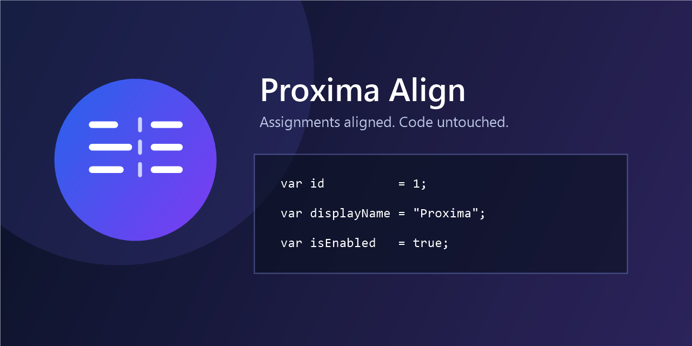

# Proxima Align Assignments



Proxima Align Assignments is a Visual Studio extension that aligns assignment
operators across selected lines while preserving indentation and source code
semantics.

## Features

- Aligns `=`, `+=`, `-=`, `*=`, `/=`, `%=`, `&=`, `|=`, `^=`, `<<=`, `>>=`,
  and `=>`.
- Handles tabs using the active editor tab size.
- Ignores operators inside strings, character literals, and comments.
- Supports multiline comments, verbatim strings, and raw strings.
- Lets you choose enabled operators and spacing behavior.
- Follows the active Visual Studio theme.

## Usage

1. Select two or more lines containing supported operators.
2. Run **Extensions > Proxima Align > Align Assignments**.
3. Alternatively, press **Ctrl+Alt+\\**.

Example:

```csharp
var id = 1;
var displayName = "Proxima";
var isEnabled = true;
```

becomes:

```csharp
var id          = 1;
var displayName = "Proxima";
var isEnabled   = true;
```

Open **Extensions > Proxima Align > Settings** or
the settings command in the **Tools** menu to configure operators and spacing.

## Requirements

- Visual Studio 17.14 or later
- Windows x64 or Arm64

## Build

Building the `.slnx` solution requires the .NET 10 SDK specified in
`global.json`.

```powershell
dotnet restore .\Proxima.Align.slnx
dotnet test .\Proxima.Align.slnx -c Release --no-restore
dotnet build .\Proxima.Align.slnx -c Release --no-restore
```

The VSIX is generated at:

```text
src\Proxima.Align\bin\Release\net8.0-windows8.0\Proxima.Align.vsix
```

Run `.\scripts\Verify-Vsix.ps1` to validate the package metadata and publication
assets. See [PUBLISHING.md](PUBLISHING.md) for the manual Marketplace checklist.

## License

Licensed under the [MIT License](LICENSE.txt).
